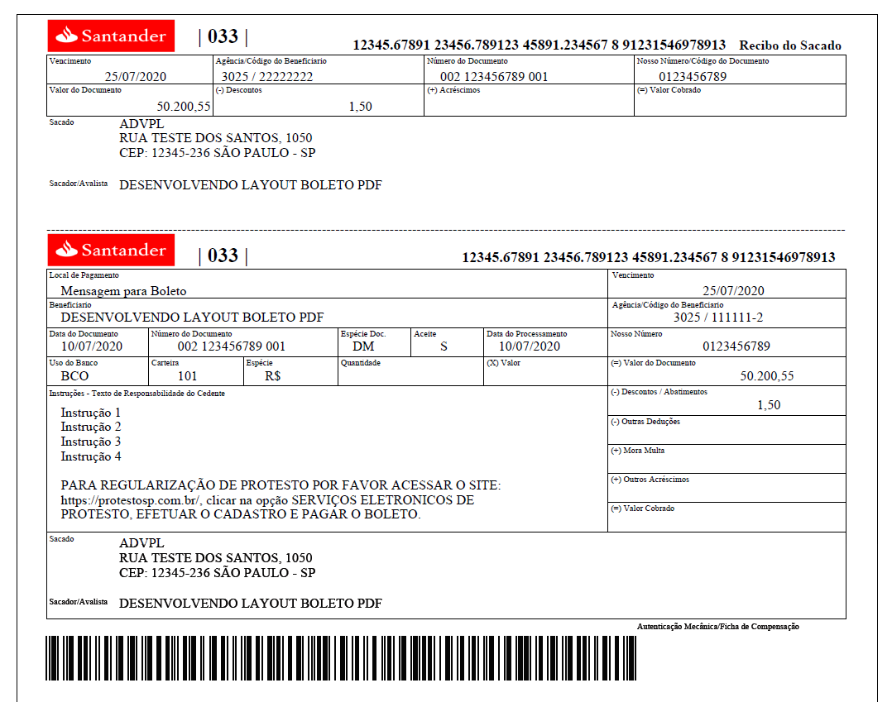

# Layout Boleto PDF
Para quem não tem noção de como fazer um Boleto, disponibilizei o Layout no modelo grafico em PDF utilizando a função FwMsPrinter.

Com esse modelo é possivel fazer o desenvolvimento para qualquer banco:

* Santander
* Bradesco
* Safra
* Itaú
* Citibank
* Banco do Brasil
* ...

# Impressão do Boleto em PDF

